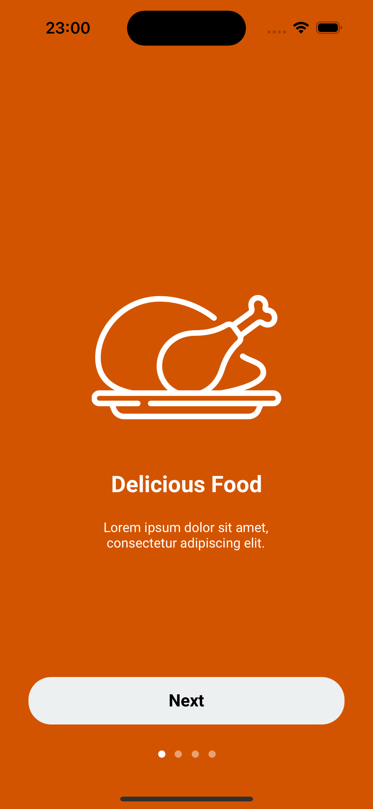
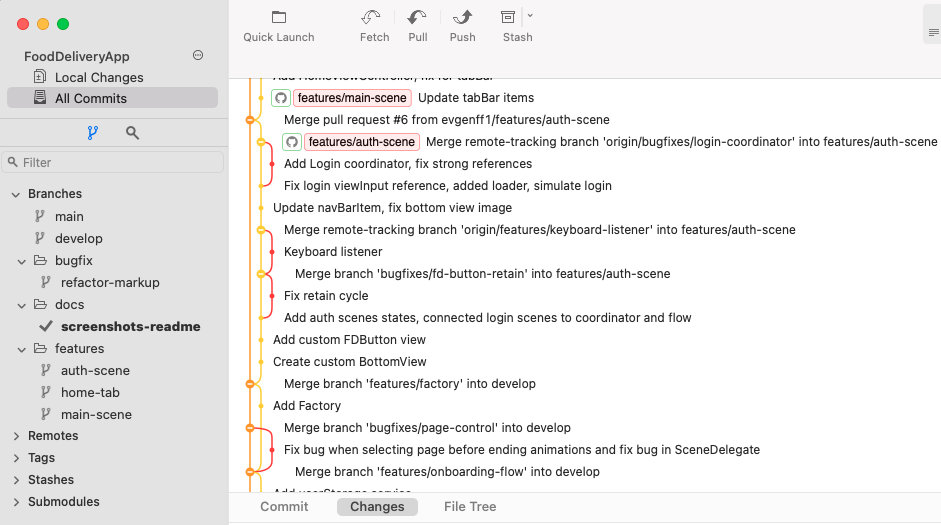

# FoodDeliveryApp 
FoodDeliveryApp is an iOS application developed for practicing UI implementation based on a Figma design.  
The app uses mock data and does not include business logic, focusing exclusively on precise UI replication.  

## Stack 
- **iOS Version:** 15.0+  
- **Technologies:** Swift, UIKit, Auto Layout, UICollectionView, UINavigationController  
- **UI:** Fully implemented in code using reusable UI components.  
- **Navigation:** Implemented using the Coordinator pattern for structured and flexible navigation.  
- **Version Control:** The project followed a structured Git workflow using Fork, including feature branches, regular commits, and merges via Fork and GitHub for practice
- **Features:**  
  - Onboarding screens at launch for smooth user introduction.
  - Login and registration screens with input fields for username, email, and password.
  - Support for keyboard interactions, including automatic UI adjustments when the keyboard appears.
  - Factory pattern for modular and maintainable scene creation.
  - Added scrolling for better content visibility on the home and food detail screens.
  - All UI elements (styles, fonts, sizes, colors) match the Figma design exactly.  
  - Resources (colors, fonts, and UI components) are stored separately for easy management.  

## Design  
[Figma Design](https://github.com/evgenff1/FoodDeliveryApp/blob/main/Design/FoodDeliveryApp.fig)  

## Screenshots

<table align="center">
  <tr>
    <td></td>
    <td></td>
  </tr>
  <tr>
    <td></td>
    <td></td>
  </tr>
  <tr>
    <td></td>
    <td></td>
  </tr>
  <tr>
    <td></td>
    <td></td>
  </tr>
</table> 

### Fork Workflow Screenshot  
  
